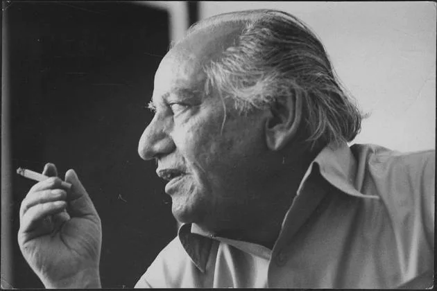

  
نظر میں ہے ہماری جادۂ راہِ فنا غالب

  
In my sight is the path of the road of extinction, Ghalib

  

    A weekly gathering at Columbia University dedicated to the study and appreciation of Urdu verse. Since 2020, we have archived our readings of classical and contemporary masters.
  

  <a href="poets/Ghalib/" class="poet-card">
    
    
Mirza Ghalib

  </a>
  <a href="poets/Faiz Ahmed Faiz/" class="poet-card">
    
    
Faiz Ahmed Faiz

  </a>
  <a href="poets/Jaun Elia/" class="poet-card">
    
JE

    
Jaun Elia

  </a>

  <a href="poets/" style="font-family: var(--font-sans); text-transform: uppercase; letter-spacing: 0.2rem; text-decoration: none; color: var(--journal-text); border-bottom: 1px solid var(--journal-text); padding-bottom: 5px;">View Full Catalog</a>

